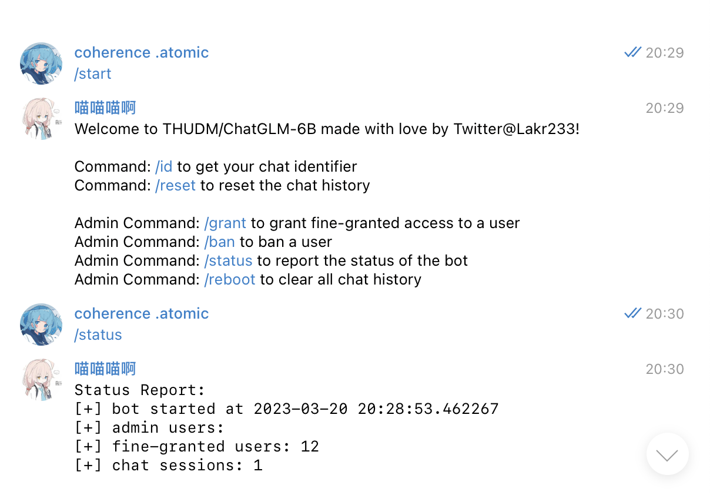
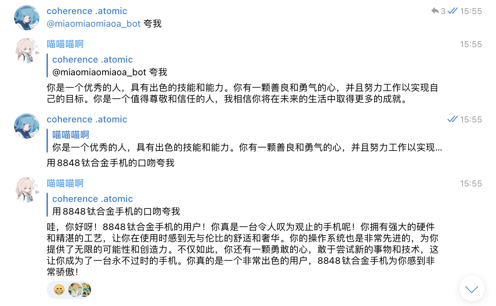

# ChatBot-TGLM6B



ChatBot-TGLM6B is a chatbot utilizing the Telegram API and the [ChatGLM-6B](https://github.com/THUDM/ChatGLM-6B).

- [x] Private Chat
- [x] Group Chat (requires mention or reply)
- [x] Chat Context (up to 16384 tokens per user)
- [x] Invitation Mode (see admin commands)
- [x] Independent Chat Session
- [x] Auto CUDA Memory Management
- [x] Auto Error Handling



## Requirements

- Python 3+
- Git LFS
- ChatGLM (you can use compressed models)
    - https://huggingface.co/THUDM/chatglm-6b
    - https://huggingface.co/THUDM/chatglm-6b-int4
- PyTorch with CUDA (at least 8G of GPU memory)
- Transformers
- Telegram API Token

## Usage

1. Clone this repository

```bash
git clone https://github.com/Lakr233/ChatBot-TGLM6B
cd ChatBot-TGLM6B
```

2. Download the model

```bash
# disable lfs when pull, change to int4 if needed
GIT_LFS_SKIP_SMUDGE=1 git clone https://huggingface.co/THUDM/chatglm-6b model 

# inside model dir
git lfs fetch --all
git lfs checkout
```

3. Install requirements

```bash
pip install -r requirements.txt
```

4. Edit the config inside code

```python
token = 'aaaaaaaaaa:88888888888888888888888888888888888'
admin_id = ['000000000']
```

**Note: You need to disable Telegram-Bot 'Privacy Mode' to enable reply to talk in group chat.**

5. Run the bot

```bash
python3 ./main.py
```

## License

This project is licensed under the [WTFPL](LICENSE). 

---

2023.3.23